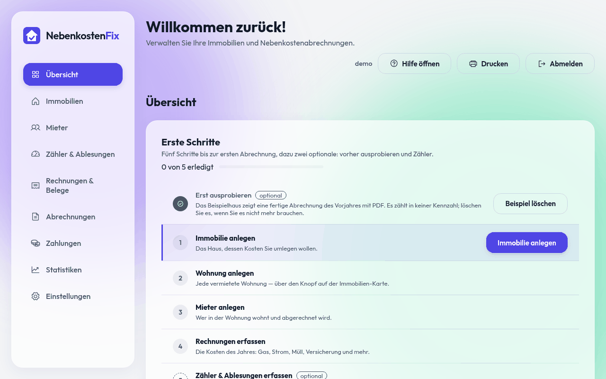
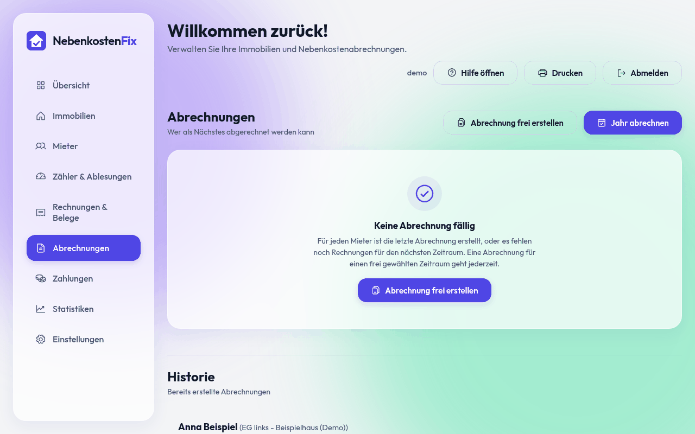
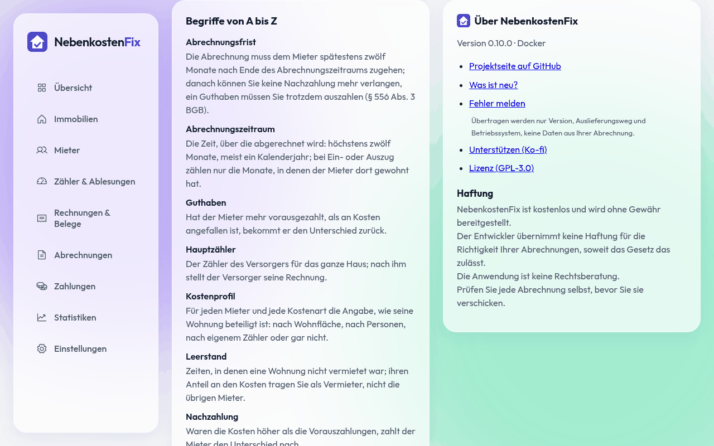

<p align="center">
  
</p>

<h1 align="center">NebenkostenFix</h1>

<p align="center">
  <strong>Die Nebenkostenabrechnung für private Vermieter. Kostenlos, und Ihre Daten bleiben bei Ihnen.</strong><br>
  <em>Free utility cost statements for private landlords in Germany, self-hosted on your own PC or server.</em>
</p>

<p align="center">
  <a href="https://github.com/Nerbry72/NebenkostenFix/releases/latest"></a>
  <a href="https://github.com/Nerbry72/NebenkostenFix/actions/workflows/ci.yml"></a>
  <a href="https://github.com/Nerbry72/NebenkostenFix/releases"></a>
  <a href="LICENSE"></a>
  <a href="https://github.com/Nerbry72/NebenkostenFix/commits/main"></a>
</p>

<p align="center">
  <a href="https://ko-fi.com/nerbry72"></a>
</p>

<p align="center">
  <a href="https://github.com/Nerbry72/NebenkostenFix/releases/latest"><strong>Herunterladen</strong></a> ·
  <a href="#docker">Docker</a> ·
  <a href="docs/handbuch/handbuch.md">Handbuch</a> ·
  <a href="docs/handbuch/faq.md">Häufige Fragen</a> ·
  <a href="#updates">Updates</a> ·
  <a href="#mitmachen">Mitmachen</a> ·
  <a href="https://ko-fi.com/nerbry72">Unterstützen</a>
</p>

<p align="center">
  
</p>

Immobilien, Wohnungen, Mieter, Zählerstände und Rechnungen liegen an einer Stelle. Am Ende
steht eine fertige Abrechnung als PDF. Die Regeln folgen BetrKV, HeizkostenV und CO2KostAufG.
Gedacht für private Vermieter mit ein bis fünfzehn Wohnungen.

Wie Sie Ihre erste Abrechnung erstellen, erklärt das [Handbuch](docs/handbuch/handbuch.md).
Kurze Antworten stehen in den [häufigen Fragen](docs/handbuch/faq.md).

## Was es kann

- **Immobilien und Wohnungen** mit beliebig vielen Einheiten und Umlageschlüsseln
- **Mieter** mit Ein- und Auszug, anteilige Abrechnung und Leerstand inbegriffen
- **Rechnungen** einzeln, als Sammelrechnung oder als Tabelle, Belege als PDF oder Foto
- **Zähler** mit Beweisfoto, Zwischenablesung und Doppeltarif (HT/NT)
- **Heizkosten** nach HeizkostenV, CO₂-Kostenaufteilung nach Stufenmodell
- **Abrechnung** als PDF mit Deckblatt, Anschreiben und Zahlungs-QR-Code (GiroCode)
- **Assistent „Jahr abrechnen“**, Beispielimmobilie, Hilfe mit Begriffen A–Z
- **Import** aus Excel oder CSV, **Umzug** zwischen Rechnern als eine `.nkfix`-Datei
- **Anmeldung** mit Benutzername und Passwort, bis zu zwei Konten

<table>
  <tr>
    <td width="50%"></td>
    <td width="50%"></td>
  </tr>
  <tr>
    <td align="center"><sub>Abrechnung: jede Kostenart, jeder Schlüssel, nachvollziehbar</sub></td>
    <td align="center"><sub>Hilfe mit Begriffen A–Z, direkt in der App</sub></td>
  </tr>
</table>

## Ihre Daten bleiben bei Ihnen

- **Kein Konto beim Herausgeber, kein Server, keine Telemetrie, keine Werbung.** Alles liegt in
  einem Ordner auf Ihrem PC oder Server.
- **Von sich aus** geht die App nur für die Suche nach Updates ins Netz, höchstens einmal am
  Tag und ohne Ihre Daten. Abschalten lässt sich das unter Einstellungen → Updates.
- **Umzug und Sicherung** sind eine einzige `.nkfix`-Datei. Sie sind an kein Gerät und an
  keinen Anbieter gebunden.

Mehr dazu in [PRIVACY.md](PRIVACY.md).

## Installation

Es gibt NebenkostenFix in zwei Formen. Beide nutzen denselben Datenbestand, ein Umzug in beide
Richtungen ist eine Datei (siehe [Umzug](#umzug-auf-einen-anderen-rechner)).

| | Windows-App | Docker |
| --- | --- | --- |
| für | einen einzelnen Windows-PC | NAS (z. B. Synology), Raspberry Pi, Heimserver |
| Zugriff | eigenes Fenster auf dem PC | Browser, von jedem Gerät im Netz |
| Installation | [`NebenkostenFix-<Version>-Setup.exe`](https://github.com/Nerbry72/NebenkostenFix/releases/latest) | `docker compose up -d` |

### Windows-App

Für einen einzelnen PC (Windows 10 ab 1809 oder Windows 11) gibt es einen Installer. Er
braucht weder Python noch Docker noch eine Kommandozeile.

1. Unter [**Releases**](https://github.com/Nerbry72/NebenkostenFix/releases/latest) die neueste `NebenkostenFix-<Version>-Setup.exe` herunterladen.
2. Ausführen und den Schritten folgen. Die App startet in ihrem eigenen Fenster (Edge WebView2).
3. Beim ersten Start ein Konto anlegen. Auf dem eigenen PC braucht das keinen Einmal-Code.

- **Programm:** `C:\Program Files\NebenkostenFix`
- **Daten:** `Dokumente\NebenkostenFix`, im Installer änderbar und nie im Programmordner.
  Liegt „Dokumente“ in OneDrive, schlägt die App einen lokalen Ort vor.
- **Update:** Die App meldet neue Versionen selbst (siehe [Updates](#updates)). Die neue
  Setup-Exe über die alte zu installieren geht ebenso. Die Daten bleiben, vorher wird gesichert.
- **Deinstallation:** Die Daten bleiben stehen, der Deinstaller sagt, wo sie liegen.
- **Passwort vergessen:** Menü „Hilfe“.

Die Prüfsumme jeder Setup-Exe steht im Release (`SHA256SUMS.txt`):

```powershell
Get-FileHash .\NebenkostenFix-0.10.0-Setup.exe -Algorithm SHA256
```

**Warnung von Windows SmartScreen:** Die Setup-Exe ist nicht mit einem Code-Signing-Zertifikat
signiert, das kostet jedes Jahr Geld. Windows zeigt deshalb beim ersten Start „Der Computer
wurde durch Windows geschützt“. Laden Sie das Setup nur hier unter Releases herunter und
vergleichen Sie die Prüfsumme. Stimmt sie, klicken Sie auf „Weitere Informationen“ und dann
auf „Trotzdem ausführen“. Updates aus der App heraus prüft NebenkostenFix selbst über eine
digitale Signatur. Die spätere Fassung aus dem Microsoft Store kommt ohne diese Warnung aus.

### Docker

Nötig ist ein Rechner mit Docker und dem Compose-Plugin. Eine Datenbank, einen
Webserver, Python oder eine `.env` braucht es nicht. Das Abbild gibt es für amd64 und
arm64.

**1. Ordner anlegen und `docker-compose.yml` hineinlegen**

```bash
mkdir nebenkostenfix && cd nebenkostenfix
# docker-compose.yml aus diesem Repository hierher kopieren
```

<details>
<summary>Solange das Paket nicht öffentlich ist: Anmeldung bei der Registry</summary>

Das Abbild liegt unter `ghcr.io/nerbry72/nebenkostenfix`. Ist das Paket privat, braucht
`docker` einmalig eine Anmeldung mit einem GitHub-Token mit dem Recht `read:packages`:

```bash
docker login ghcr.io -u <github-name>
```

Auf der Synology: Container Manager → Registry → Einstellungen, dort `ghcr.io` mit
GitHub-Name und Token hinzufügen.

</details>

**2. Starten**

```bash
docker compose up -d
```

Neben der Compose-Datei entsteht der Datenordner `daten/`. Wer aus dem Quellcode
bauen will, startet mit `docker compose up -d --build`.

**3. Einrichten im Browser**

`http://<rechner>:6060` öffnen. Solange es noch kein Konto gibt, zeigt die Anwendung die
Einrichtung. Dort vergeben Sie Benutzername und Passwort (mindestens zehn Zeichen)
und geben den **Einmal-Code** ein. Der Code steht nur auf dem Server, damit sich niemand
im Netz ein Konto anlegen kann:

```bash
cat daten/ERSTEINRICHTUNG-CODE.txt
docker compose logs web | grep Einmal-Code
```

Nach fünf falschen Versuchen gilt ein neuer Code. Nach der Einrichtung verschwindet die
Datei. Den Sitzungsschlüssel erzeugt die Anwendung selbst, er liegt in `daten/secret_key`.

**4. Prüfen**

```bash
docker compose ps                         # STATUS: Up (healthy)
curl http://localhost:6060/api/health     # {"status":"ok", ...}
```

#### Synology (ohne Kommandozeile)

1. **Ordner anlegen:** In der File Station einen Ordner anlegen, z. B. `docker/nebenkostenfix`.
2. **Projekt anlegen:** Container Manager → Projekt → Erstellen. Als Name `nebenkostenfix`
   eintragen, als Pfad den Ordner aus Schritt 1. Bei Quelle „docker-compose.yml hochladen“
   wählen.
3. **Nutzer eintragen:** In der Compose-Datei (oder einer `.env` daneben) `PUID` und `PGID`
   auf den DSM-Nutzer setzen, dem der Ordner gehört (per SSH: `id <name>`). Sonst kann der
   Container nicht in `daten/` schreiben.
4. **Starten:** Mit „Weiter“ bis „Fertig“. Der Container Manager lädt das Abbild und startet
   es.
5. **Einmal-Code:** In der File Station `docker/nebenkostenfix/daten/ERSTEINRICHTUNG-CODE.txt`
   öffnen.
6. **Einrichten:** `http://<synology>:6060` im Browser öffnen, Konto anlegen und den Code
   eintragen.

#### Einstellungen

Die Anwendung läuft ohne jede Einstellung. Wer etwas ändern will, legt eine `.env` neben
die Compose-Datei. `.env.example` erklärt jeden Wert. Die wichtigsten:

| Variable | Wirkung | Standard |
| --- | --- | --- |
| `APP_PORT` | Port auf dem Wirt | `6060` |
| `PUID` / `PGID` | Nutzer, dem der Datenordner gehört | `1000` |
| `NK_VERSION` | Welche Version Compose startet | `latest` |
| `BEHIND_HTTPS` | `1` hinter einem HTTPS-Proxy | aus |
| `ERLAUBTE_URSPRUENGE` | öffentliche Adresse, wenn der Proxy den Host umschreibt | leer |
| `SITZUNG_LEERLAUF_MIN` | Abmeldung nach so vielen Minuten ohne Aktivität | `60` |
| `MAX_UPLOAD_MB` | größter Beleg | `32` |
| `BACKUP_ZIELE` | zusätzliche Ordner für Sicherungen, mit `:` getrennt | leer |
| `VERMIETER_NAME` / `VERMIETER_IBAN` | Zahlungs-QR-Code auf der Abrechnung | leer |
| `LOG_LEVEL` | `DEBUG` … `CRITICAL` | `INFO` |

#### HTTPS und Reverse Proxy

Im eigenen LAN reicht `http://`. Passwort und Mieterdaten gehen dann aber im Klartext
durchs Netz, und die Anwendung warnt beim Start. Für den Zugriff von außen gehört ein
Reverse Proxy mit Zertifikat davor:

- **Synology:** Systemsteuerung → Anmeldeportal → Erweitert → Reverse Proxy. Als Quelle
  `https://nk.<ihre-domain>:443` eintragen, als Ziel `http://localhost:6060`.
- **Caddy:**

  ```
  nk.example.org {
      reverse_proxy 127.0.0.1:6060
  }
  ```

- **nginx:** `proxy_pass http://127.0.0.1:6060;` mit `proxy_set_header Host $host;`,
  `proxy_set_header X-Forwarded-Proto https;` und `client_max_body_size 32m;`.

Danach in der `.env` `BEHIND_HTTPS=1` setzen und den Port nur noch lokal binden:
`APP_PORT=127.0.0.1:6060`.

#### Betrieb

```bash
docker compose logs -f web                     # Protokoll mitlesen
docker compose restart web                     # neu starten
docker compose down                            # anhalten, Daten bleiben
docker compose pull && docker compose up -d    # Update auf die neueste Version
```

Nach einem Update passt die Anwendung das Datenbankschema beim Start selbst an und sichert
vorher automatisch. Eine bestimmte Version starten Sie mit `NK_VERSION=0.10.0` in der `.env`.

Tritt ein unerwarteter Fehler auf, zeigt die Anwendung eine **Vorgangsnummer**. Unter dieser
Nummer steht im Protokoll, was passiert ist:

```bash
grep A1B2C3D4 daten/nebenkosten.log
```

#### Konten auf der Kommandozeile

Ein zweites Konto legen Sie in der Oberfläche unter Einstellungen an. Für den Notfall gibt
es die Kommandozeile:

```bash
docker compose exec web flask users list
docker compose exec web flask users passwd <name>    # Passwort vergessen, hebt auch eine Sperre auf
docker compose exec web flask users add <name>
docker compose exec web flask users disable <name>
```

---

## Updates

Beim Start sieht NebenkostenFix höchstens einmal am Tag nach, ob es eine neue Version gibt,
und meldet sie mit einem kurzen Hinweis. „Später erinnern“ schiebt ihn auf, unter
Einstellungen → Updates lässt sich die Suche abschalten oder von Hand anstoßen.

- **Windows-App:** „Update installieren“ lädt die neue Setup-Exe, prüft Signatur und
  Prüfsumme, sichert Ihre Daten und installiert. Die App startet danach neu.
- **Docker:** Die App nennt die neue Version. Aktualisiert wird wie gewohnt mit
  `docker compose pull && docker compose up -d`.
- **Microsoft Store:** Dort aktualisiert der Store, die App sucht nicht selbst.

Jede Version beschreiben die [Releases](https://github.com/Nerbry72/NebenkostenFix/releases).

---

## Daten

### Wo die Daten liegen

Alles liegt in einem Ordner: bei Docker in `daten/` neben der Compose-Datei (im Container
`/data`), bei Windows in `Dokumente\NebenkostenFix`.

| Pfad | Inhalt |
| --- | --- |
| `nebenkosten.db` | die gesamte Datenbank (SQLite) |
| `belege/` | Rechnungen, Verträge, Zählerfotos und Abrechnungs-PDFs |
| `backups/` | Sicherungen |
| `import/` | hier abgelegte `.nkfix`-Pakete bietet die Übernahme zur Auswahl an |
| `secret_key` | Sitzungsschlüssel, entsteht beim ersten Start |
| `nebenkosten.log` | Protokoll, bei 5 MB umgeschichtet, höchstens fünf alte Stände |

Die Anwendung spricht selbst kein SMB oder NFS. Soll der Ordner auf einem NAS liegen,
binden Sie ihn dort ein oder betreiben den Container direkt auf dem NAS.

### Sichern und Zurückholen

Eine Sicherung ist eine `.nkfix`-Datei, also ein ZIP. Darin stecken die Datenbank, alle
Belege, Vermieterdaten, Logo und Einstellungen sowie eine Prüfsumme je Datei. In der Oberfläche
steht das unter Einstellungen → Datensicherung. Auf der Kommandozeile:

```bash
docker compose exec web flask backup create
docker compose exec web flask backup info /data/backups/sicherung-20260315-030000.nkfix
```

Zurückholen ersetzt Datenbank und Belege, die Anwendung sollte dabei nicht laufen:

```bash
docker compose stop web
docker compose run --rm --no-deps web flask backup restore /data/backups/sicherung-20260315-030000.nkfix
docker compose up -d
```

Vor dem Ersetzen prüft die Anwendung jede Prüfsumme und sichert den aktuellen Stand als
`sicherung-vor-einspielen-*.nkfix`. Ein älteres Archiv hebt sie auf den aktuellen
Schemastand. Ein Archiv aus einer neueren Version lehnt sie ab.

Eine Sicherung auf derselben Platte schützt nicht vor einem Plattenschaden. Kopieren Sie sie
deshalb auf einen anderen Rechner oder eine externe Platte, oder tragen Sie ein zweites Ziel
in `BACKUP_ZIELE` ein.

### Umzug auf einen anderen Rechner

Dieselbe `.nkfix`-Datei ist auch das Umzugspaket, zwischen Docker und Windows in beide
Richtungen.

1. **Alter Rechner:** Einstellungen → Datensicherung → „Alles exportieren“
   (oder `docker compose exec web flask umzug export`).
2. **Neuer Rechner, frisch installiert:** Auf der Einrichtungsseite „Daten aus einer anderen
   Installation übernehmen“ wählen. Danach melden Sie sich mit dem bisherigen Konto an.
3. **Neuer Rechner, schon in Benutzung:** Einstellungen → Datensicherung → „Daten übernehmen
   (ersetzt alles)“. Der jetzige Stand wird vorher gesichert.

Große Pakete lädt der Browser in Stücken hoch. Nach einem Abbruch geht es an derselben
Stelle weiter. Unter Docker können Sie das Paket auch nach `daten/import/` legen. Nicht im
Paket sind Sitzungsschlüssel, Sicherungsziele und Anmeldesperren.

### Daten aus Excel übernehmen

In den Bereichen Immobilien, Mieter, Zähler, Rechnungen und Zahlungen führt „Aus Excel
importieren“ durch drei Schritte: Vorlage (XLSX oder CSV), Zuordnung der Spalten und ein
Probelauf mit Fehlern je Zeile. Übernommen wird nur, wenn keine Zeile einen Fehler hat.

---

## Sicherheit

- Ohne Anmeldung öffnet sich keine Seite. Einzige Ausnahme ist `/api/health`.
- Nach 5 Fehlversuchen für ein Konto (oder 20 von einer Adresse) ist die Anmeldung
  15 Minuten gesperrt.
- Schreibende Anfragen von fremden Seiten lehnt die Anwendung ab. Jede Antwort trägt eine
  Content-Security-Policy ohne fremde Quellen.
- Der Container läuft nicht als root.
- Updates sind signiert. Ein verändertes Manifest oder ein Installer mit falscher Prüfsumme
  wird verworfen.

Sicherheitslücken bitte nicht als öffentliches Issue melden, sondern vertraulich wie in
[SECURITY.md](SECURITY.md) beschrieben.

---

## Haftung

NebenkostenFix ist kostenlos und wird ohne Gewähr bereitgestellt. Der Entwickler übernimmt
keine Haftung für die Richtigkeit Ihrer Abrechnungen, soweit das Gesetz das zulässt. Die
Anwendung ist keine Rechtsberatung. Prüfen Sie jede Abrechnung selbst, bevor Sie sie
verschicken.

## Unterstützen

NebenkostenFix ist kostenlos und bleibt es. Wenn es Ihnen Arbeit spart, freue ich mich über
einen Kaffee:

<a href="https://ko-fi.com/nerbry72"></a>

Genauso hilft ein Stern für das Repository, ein Fehlerbericht oder eine Empfehlung an andere
Vermieter.

## Mitmachen

- **Fehler gefunden?** [Fehler melden](https://github.com/Nerbry72/NebenkostenFix/issues/new?template=fehler.yml),
  in der App auch über Hilfe → „Über NebenkostenFix“. Bitte ohne echte Mieterdaten.
- **Idee oder Frage?** In den [Discussions](https://github.com/Nerbry72/NebenkostenFix/discussions).
- **Code beitragen?** [CONTRIBUTING.md](CONTRIBUTING.md) erklärt Umgebung, Tests und Ablauf.

---

## Entwicklung

Wie Sie mitmachen, steht in [CONTRIBUTING.md](CONTRIBUTING.md).

### Voraussetzungen

Python 3.11. Alle Werkzeuge kommen aus `requirements-dev.txt`.

```bash
python3.11 -m venv .venv && . .venv/bin/activate
pip install -r requirements.txt
make install-dev
make check          # Lint, Glossar, Bandit, Tests, Einzelschwelle, Abdeckung Rechenkern
flask --app app run --port 6070
```

Weitere Prüfungen:

| Befehl | Was |
| --- | --- |
| `make audit` | bekannte Lücken in den Abhängigkeiten (pip-audit) |
| `python scripts/rundgang.py` | Browser-Rundgang in drei Breiten (Playwright) |
| `python desktop.py` | Windows-App aus den Quellen starten |

Tests laufen nie gegen einen Datenordner mit echten Daten.

### Arbeitsablauf

`main` ist immer veröffentlichbar. Direkte Pushes auf `main` gibt es nicht.

1. Einen Feature-Branch von `main` abzweigen, z. B. `feature/zaehler-import` oder
   `fix/pdf-umbruch`.
2. Committen und pushen.
3. Einen Pull Request nach `main` öffnen. Dann laufen die CI (`ci.yml`), der Windows-Bau
   mit Installer-, Update- und Umzugsprobe (`windows.yml`) und der Browser-Rundgang
   (`rundgang.yml`), jeweils einmal pro Stand.
4. `SOFTWARE_VERSION` in `nebenkostenfix/abrechnung_version.py` anheben. Die CI lehnt einen Pull Request ab,
   dessen Version schon veröffentlicht ist.
5. Nach dem Merge baut `release.yml` alles und veröffentlicht es.

### Versionen und Releases

Die Versionsnummer steht an genau einer Stelle: `SOFTWARE_VERSION` in `nebenkostenfix/abrechnung_version.py`
(Schema `x.y.z`). Jeder Merge nach `main` löst `release.yml` aus:

1. Die Tests laufen nicht noch einmal: `main` nimmt nur aktuelle Pull Requests mit grünen
   Checks an. Ein Commit ohne gemergten Pull Request wird nicht veröffentlicht.
2. Windows-App bauen (PyInstaller und Inno Setup), still installieren, über eine Vorversion
   aktualisieren und wieder deinstallieren.
3. Docker-Abbild bauen, Rauchtest, dann für amd64 und arm64 nach
   `ghcr.io/nerbry72/nebenkostenfix:<version>` und `:latest` schieben.
4. GitHub-Release `v<version>` mit `NebenkostenFix-<version>-Setup.exe`, `SHA256SUMS.txt` und
   dem signierten `update.json` anlegen. Aus dem `update.json` erfahren die installierten Apps
   von der neuen Version.

### Aufbau

| Pfad | Inhalt |
| --- | --- |
| `app.py` | Flask-Anwendung und API |
| `nebenkostenfix/` | Anwendungscode, den `app.py` und `desktop.py` einbinden |
| `nebenkostenfix/rechenkern.py`, `betrkv.py`, `heizung.py`, `co2.py` | Abrechnungsregeln |
| `nebenkostenfix/models.py`, `migrations/` | Datenmodell (SQLAlchemy) und Schema-Wanderungen (Alembic) |
| `nebenkostenfix/pdf_generator.py`, `pdf_cover_page.py` | PDF-Abrechnung (reportlab) |
| `nebenkostenfix/backup.py`, `umzug.py` | Sicherung, Einspielen, Umzugspaket |
| `desktop.py`, `packaging/windows/` | Windows-App und Installer |
| `static/` | Oberfläche (HTML, CSS, JavaScript ohne Framework) |
| `docs/glossar.md` | verbindliche Begriffe der Oberfläche, gegen die `make ui` prüft |
| `tests/` | pytest |

---

## Lizenz

NebenkostenFix steht unter der [GNU General Public License v3.0](LICENSE) oder, nach Ihrer
Wahl, einer späteren Fassung (GPL-3.0-or-later). Sie dürfen es nutzen, weitergeben und
verändern. Veränderte Fassungen müssen unter derselben Lizenz stehen und ihren Quellcode
offenlegen.
